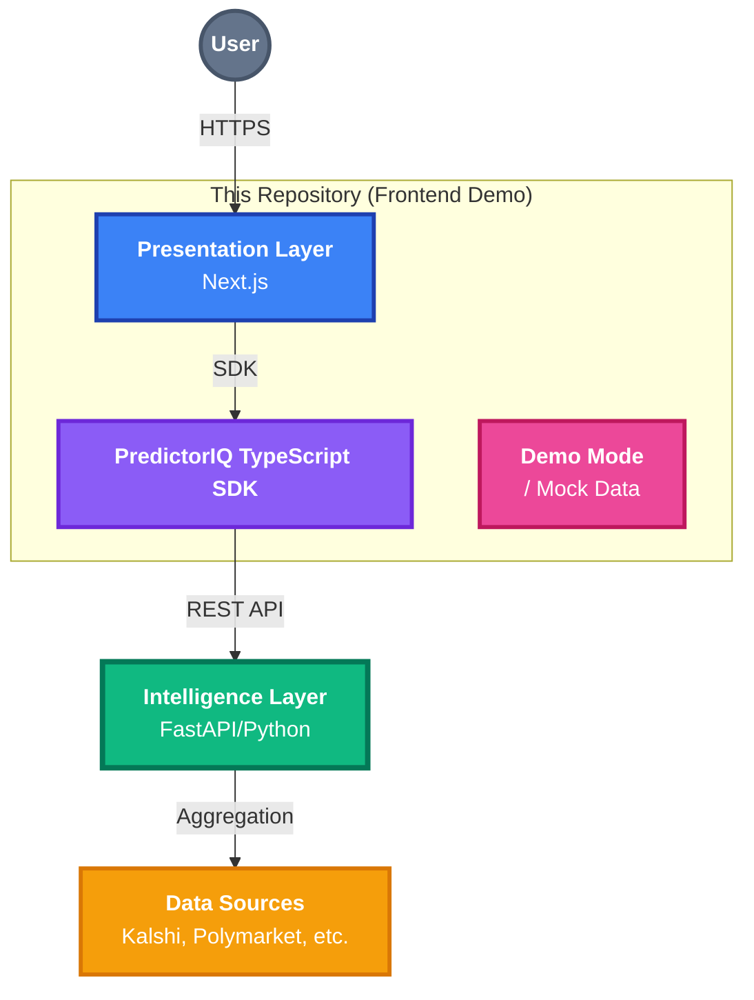
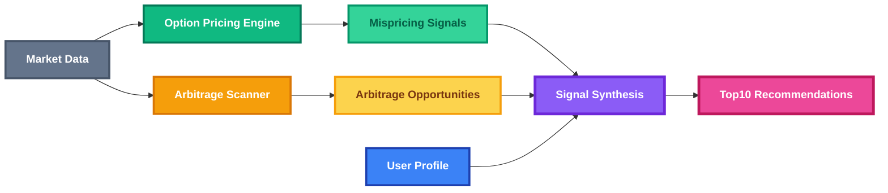
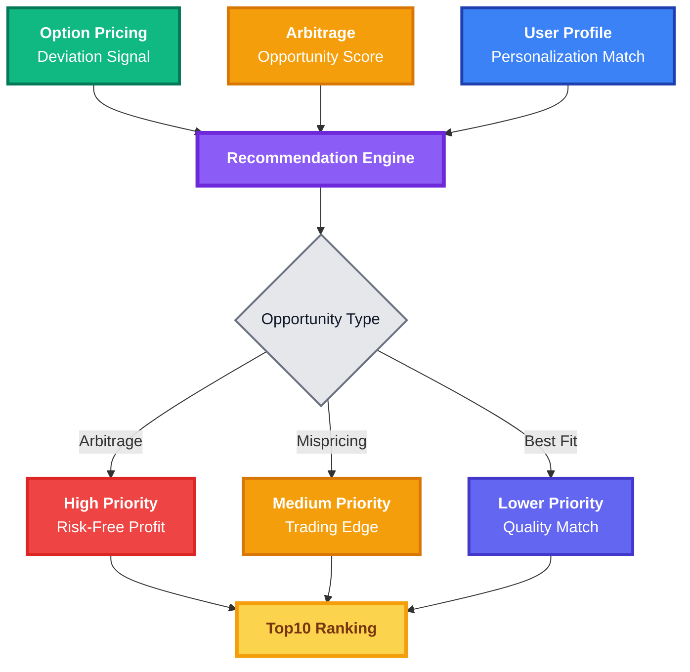
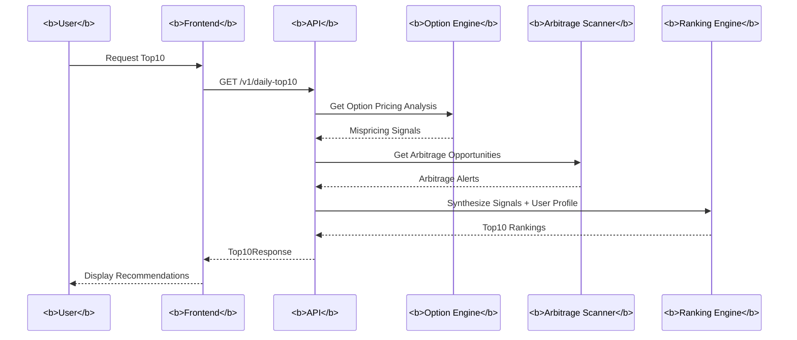

# PredictorIQ - Architecture Overview

PredictorIQ follows a modern, three-layer architectural pattern designed for high throughput and low-latency intelligence.

---

## System Architecture

---

## 1. Presentation Layer (Public Repo)

The user interface is built using **Next.js 14** with the App Router, offering a professional, responsive dashboard.

### Core Stack
- **Framework**: React 18 / Next.js 14
- **Language**: TypeScript
- **Styling**: Tailwind CSS
- **State Management**: React Query / Context API

### Demo Mode Architecture
To facilitate immediate evaluation, the frontend includes a **Demo Mode (Mock Data)** sub-module. This allows the UI to render realistic, high-fidelity sample data without a backend connection.

---

## 2. Intelligence Layer (Private)

The backend is a high-performance Python ecosystem designed for real-time market analysis.

### High-Level Service Modules

#### 2.1 Data Ingestion Engine
Continuously polls prediction exchanges for new markets and price updates across Polymarket, Kalshi, Opinion, and Limitless.

#### 2.2 Normalization Layer
Converts platform-specific formats (e.g., Kalshi's cents vs. Polymarket's decimals) into a unified schema.

#### 2.3 Analysis Engines (v0.2)

**Option Pricing Engine (v0.2)**:
- Maps prediction markets to equivalent option payoffs (digital/barrier options)
- Uses implied volatility from real option markets (Deribit, CBOE, etc.)
- Computes risk-neutral fair probabilities
- Identifies markets that are cheap, fair, or expensive relative to option markets

**Arbitrage Scanner (v0.2)**:
- Normalizes event definitions across platforms
- Compares implied probabilities to detect price discrepancies
- Calculates spread percentages and identifies executable arbitrage opportunities
- Provides execution instructions (buy on Platform A, sell on Platform B)

#### 2.4 Ranking & Scoring System

**How Top10 Ranking Works**:
1. **Primary Signal Detection**: Identifies markets with arbitrage opportunities OR pricing deviations from option markets
2. **Signal Strength**: Quantifies the magnitude (e.g., 7% arbitrage spread, 5% pricing deviation)
3. **Personalization Matching**: Matches user expertise and preferences to market categories
4. **Liquidity Check**: Ensures sufficient liquidity for execution
5. **Final Ranking**: Combines opportunity score + personalization fit to produce Top10

**Output**: Ranked list of markets with:
- **Primary Signal**: What triggered the recommendation (arbitrage, mispricing, or best fit)
- **Explicit Rationale**: Why this market is recommended
- **Actionability**: Specific recommendation (buy/sell/avoid)

---

## 3. PredictorIQ SDK

The SDK provides a type-safe interface for any frontend or automated trading system to interact with the PredictorIQ intelligence layer.

**Key Features:**
- Fully typed using TypeScript interfaces
- Lightweight, axios-based client
- Built-in support for environment-based configuration

**Core Endpoints:**
- `getDailyTop10(userProfile?)`: Get personalized Top10 recommendations (v0.1 + v0.2)
- `getArbitrageAlerts()`: Real-time arbitrage opportunities (v0.2)
- `getOptionPricingAnalysis(marketId)`: Option-anchored pricing analysis (v0.2)

---

## 4. Data Flow: Top10 Generation

---

## 5. Scalability & Performance

- **Data Refresh**: Market data is typically updated every 5-15 minutes depending on volume
- **Latency**: The system is optimized for fast discovery rather than high-frequency execution
- **Option Pricing**: Calculated on-demand, cached for frequently accessed markets
- **Arbitrage Scanning**: Continuous monitoring with alerts generated within 30 seconds of detection
- **Security**: The architecture supports secure lead capture via Formspree and API-key-based authentication in live mode

---

**Last Updated**: January 2026  
**Version**: 0.2  
**Contact**: nelson.jingusc@gmail.com
