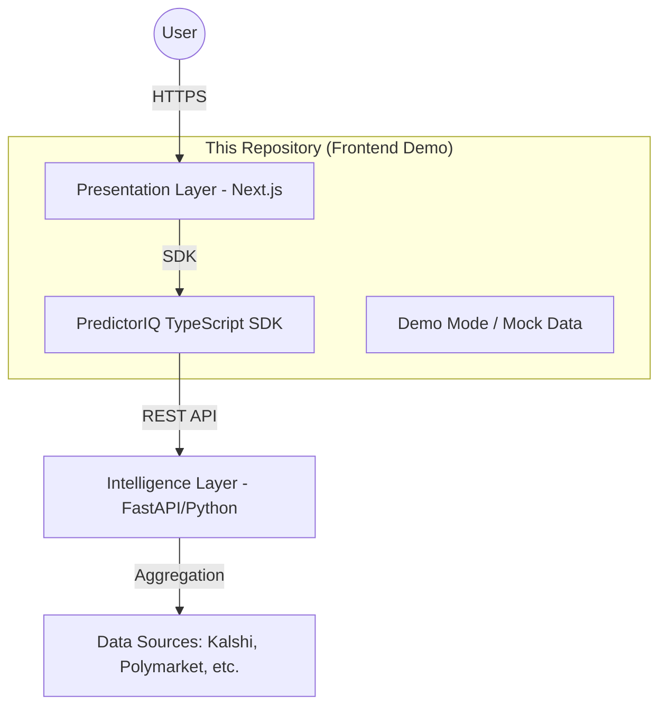

# PredictorIQ - Architecture Overview

PredictorIQ follows a modern, three-layer architectural pattern designed for high throughput and low-latency intelligence.

---

## System Architecture

---

## 1. Presentation Layer (Public Repo)

The user interface is built using **Next.js 14** with the App Router, offering a professional, responsive dashboard.

### Core Stack
- **Framework**: React 18 / Next.js 14
- **Language**: TypeScript
- **Styling**: Tailwind CSS
- **State Management**: React Query / Context API

### Demo Mode Architecture
To facilitate immediate evaluation, the frontend includes a **Demo Mode (Mock Data)** sub-module. This allows the UI to render realistic, high-fidelity sample data without a backend connection.

---

## 2. Intelligence Layer (Private)

The backend is a high-performance Python ecosystem designed for real-time market analysis.

### High-Level Service Modules
1.  **Ingestion Engine**: Continuously polls prediction exchanges for new markets and price updates.
2.  **Normalization Layer**: Converts platform-specific formats (e.g., Kalshi's cents vs. Polymarket's decimals) into a unified schema.
3.  **Ranking & Scoring System**:
    - **Baseline Scoring**: Evaluates market quality and liquidity.
    - **Personalization Engine**: Matches users to markets based on professional profiles.
    - **Rationale Generation**: Uses LLMs to produce concise edge explanations.
4.  **Agent Logic**: Orchestrates specialized AI agents (Alpha Scout, Portfolio Guardian, Research Autopilot).

---

## 3. PredictorIQ SDK

The SDK provides a type-safe interface for any frontend or automated trading system to interact with the PredictorIQ intelligence layer.

**Key Features:**
- Fully typed using TypeScript interfaces.
- Lightweight, axios-based client.
- Built-in support for environment-based configuration.

---

## 4. Scalability & Performance

- **Data Refresh**: Market data is typically updated every 5-15 minutes depending on volume.
- **Latency**: The system is optimized for fast discovery rather than high-frequency execution.
- **Security**: The architecture supports secure lead capture via Formspree and API-key-based authentication in live mode.

---

**Last Updated**: December 2024
**Contact**: nelson.jingusc@gmail.com
