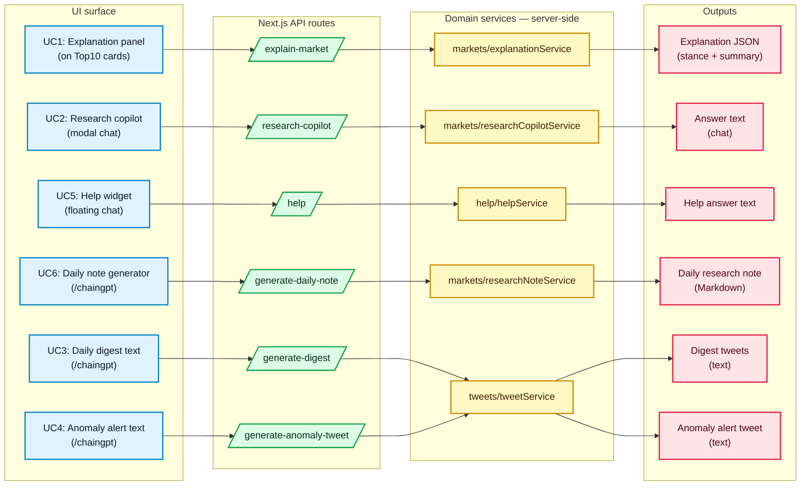

# ChainGPT Integration Overview (Architecture + Functionality)

This page describes how ChainGPT is integrated in this branch, and what the integration does and does not do.

## 1) High-level Architecture

- PredictorIQ core logic (pricing, scoring, anomaly detection, cross-market comparison) runs as deterministic code.
- ChainGPT sits above that layer to interpret structured outputs and produce human/agent-friendly text.
- All ChainGPT calls are made server-side via Next.js API routes. The client never accesses model credentials.
- The model consumes structured JSON signals, not raw market feeds.

```mermaid
flowchart TB
  %% Colors chosen for high contrast and readability.
  classDef client fill:#E0F2FE,stroke:#0284C7,color:#0F172A,stroke-width:2px;
  classDef api fill:#DCFCE7,stroke:#16A34A,color:#052E16,stroke-width:2px;
  classDef core fill:#FEF9C3,stroke:#CA8A04,color:#422006,stroke-width:2px;
  classDef model fill:#FFE4E6,stroke:#E11D48,color:#4C0519,stroke-width:2px;
  classDef util fill:#EDE9FE,stroke:#7C3AED,color:#1E1B4B,stroke-width:2px;

  subgraph C["Client — Next.js + React"]
    UI1["Top10 UI<br/>- Explanation panel (UC1)<br/>- Research copilot (UC2)"]:::client
    UI2[Help widget (UC5)]:::client
    UI3["ChainGPT preview page<br/>(UC3/UC4/UC6)"]:::client
  end

  subgraph A["Server — Next.js API routes"]
    R1[/POST /api/chaingpt/explain-market/]:::api
    R2[/POST /api/chaingpt/research-copilot/]:::api
    R3[/POST /api/chaingpt/help/]:::api
    R4[/POST /api/chaingpt/generate-daily-note/]:::api
    R5[/POST /api/chaingpt/generate-digest/]:::api
    R6[/POST /api/chaingpt/generate-anomaly-tweet/]:::api
  end

  subgraph P["PredictorIQ signals — deterministic"]
    S1["Structured MarketSignal JSON<br/>(mispricing, anomalyScore,<br/>liquidity, etc.)"]:::core
  end

  subgraph L["ChainGPT"]
    M1["ChainGPT model API<br/>(HTTPS)"]:::model
  end

  subgraph D["Demo fallback — optional"]
    F1["Deterministic demo responses<br/>when demo mode is on<br/>and no API key is set"]:::util
  end

  UI1 --> R1
  UI1 --> R2
  UI2 --> R3
  UI3 --> R4
  UI3 --> R5
  UI3 --> R6

  S1 --> R1
  S1 --> R2
  S1 --> R4
  S1 --> R5
  S1 --> R6

  R1 --> M1
  R2 --> M1
  R3 --> M1
  R4 --> M1
  R5 --> M1
  R6 --> M1

  R1 -. demo mode .-> F1
  R2 -. demo mode .-> F1
  R3 -. demo mode .-> F1
  R4 -. demo mode .-> F1
  R5 -. demo mode .-> F1
  R6 -. demo mode .-> F1
```

## 2) Role of ChainGPT in the System

- ChainGPT does not perform numerical pricing or financial calculations.
- Its role is to interpret existing signals, resolve conflicting indicators, and produce clear explanations for humans and agents.
- Typical outputs include market summaries, rationale for “participate / avoid” assessments, and contextual answers to user questions.

## 3) Core Integrated Functionalities

- Market Explanation Panel (UC1): structured signals → short explanation.
- Research Copilot (UC2): follow-up Q&A grounded in the same structured context.
- Help / Onboarding Chat (UC5): product concepts and metric explanations with project-specific context.
- Agent-facing Content Generation (UC3/UC4/UC6): daily note + digest + anomaly text generation (text-only; no execution).



## 4) Execution and Safety Model

- No private keys, wallets, or trading execution are handled by ChainGPT or this integration.
- Any future execution logic is intentionally separated and platform-dependent.
- This keeps reasoning, execution, and settlement loosely coupled.

## 5) Intended Usage

- Designed for long-running workflows (not one-off demos).
- Works inside the PredictorIQ app and can serve as a base for external research/alert agents (for example via AgenticOS), while keeping execution external and optional.

