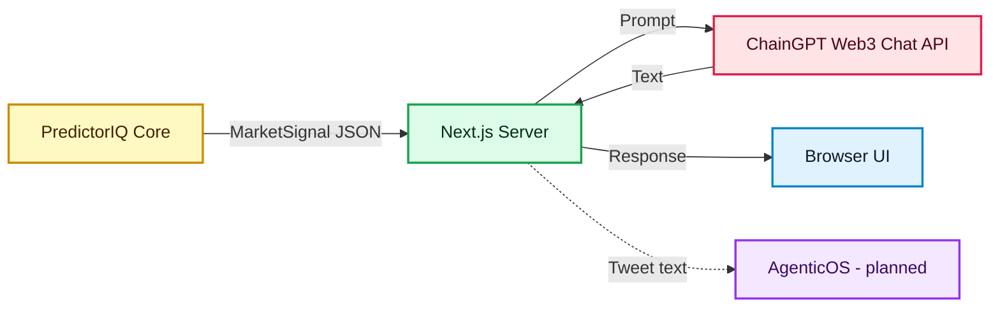
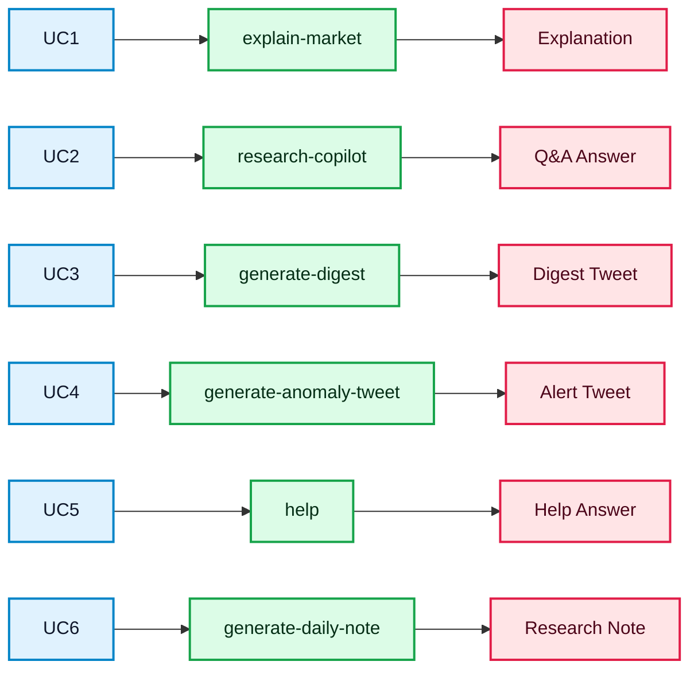

# ChainGPT Integration Overview

This page explains how ChainGPT is integrated in this branch.

---

## 1. System Architecture

**What this diagram shows:**
- PredictorIQ produces structured market signals.
- ChainGPT Web3 Chat API generates human-readable explanations.
- AgenticOS is a planned channel for automated social posting.
- All ChainGPT calls happen server-side. The browser never sees API keys.

**Key point:** ChainGPT does NOT do math or pricing. It only interprets and explains.

---

## 2. Feature Flow

**What this diagram shows:**
- UC1 to UC6 are the six features we built.
- Each feature connects to a server endpoint and produces a specific output.

**UC1 to UC6 explained:**

| UC | Name | What it does | Where in UI |
|----|------|--------------|-------------|
| UC1 | Market Explanation | Short summary of why a market looks cheap or expensive | Top10 page, each card |
| UC2 | Research Q&A | User asks follow-up questions about a market | Top10 page, modal |
| UC3 | Daily Digest Tweet | Generates tweet text for daily market highlights | /chaingpt preview |
| UC4 | Anomaly Alert Tweet | Generates alert tweet when unusual activity detected | /chaingpt preview |
| UC5 | Product Help | Explains PredictorIQ metrics and concepts | Floating help widget |
| UC6 | Daily Research Note | Generates Markdown summary of top markets | /chaingpt preview |

---

## 3. ChainGPT APIs Used

| API | What we use it for | Status |
|-----|-------------------|--------|
| **Web3 Chat API** | All text generation - explanations, Q&A, help, notes, tweets | Implemented |
| **AgenticOS** | Automated posting to X/Twitter | Planned - not yet wired |

Web3 Chat API endpoint: `POST https://api.chaingpt.org/chat/stream`

---

## 4. Demo Mode

When running without a ChainGPT API key:
- Server returns pre-written example responses.
- All UI features work, but responses are static.
- No API credits consumed.

---

## 5. What This Integration Does NOT Do

- No trading execution
- No wallet or private key handling
- No on-chain transactions
- No replacing deterministic pricing with model-generated numbers
