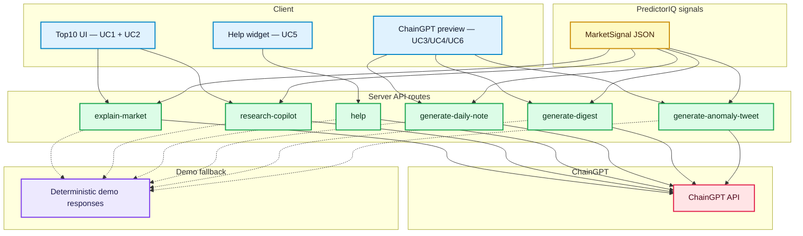
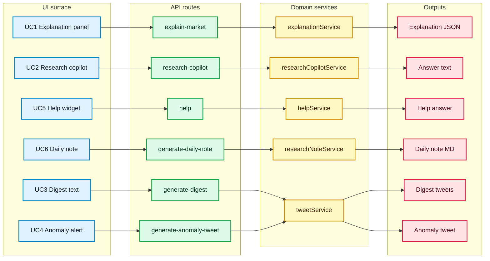

# ChainGPT Integration Overview

This page describes how ChainGPT is integrated in this branch, and what the integration does and does not do.

## 1. High-level Architecture

- PredictorIQ core logic — pricing, scoring, anomaly detection, cross-market comparison — runs as deterministic code.
- ChainGPT sits above that layer to interpret structured outputs and produce human/agent-friendly text.
- All ChainGPT calls are made server-side via Next.js API routes. The client never accesses model credentials.
- The model consumes structured JSON signals, not raw market feeds.

## 2. Role of ChainGPT in the System

- ChainGPT does not perform numerical pricing or financial calculations.
- Its role is to interpret existing signals, resolve conflicting indicators, and produce clear explanations for humans and agents.
- Typical outputs include market summaries, rationale for participate/avoid assessments, and contextual answers to user questions.

## 3. Core Integrated Functionalities

- **Market Explanation Panel — UC1**: structured signals to short explanation.
- **Research Copilot — UC2**: follow-up Q&A grounded in the same structured context.
- **Help / Onboarding Chat — UC5**: product concepts and metric explanations with project-specific context.
- **Agent-facing Content Generation — UC3/UC4/UC6**: daily note + digest + anomaly text generation; text-only, no execution.

## 4. Execution and Safety Model

- No private keys, wallets, or trading execution are handled by ChainGPT or this integration.
- Any future execution logic is intentionally separated and platform-dependent.
- This keeps reasoning, execution, and settlement loosely coupled.

## 5. Intended Usage

- Designed for long-running workflows, not one-off demos.
- Works inside the PredictorIQ app and can serve as a base for external research/alert agents via AgenticOS, while keeping execution external and optional.
