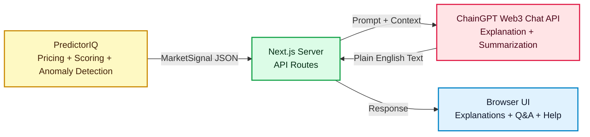

# ChainGPT Integration Overview

This page explains how ChainGPT is integrated in this branch.

---

## 1. System Architecture

**What this diagram shows:**
- PredictorIQ produces structured market signals (pricing, anomaly scores, liquidity).
- ChainGPT Web3 Chat API takes those signals and generates human-readable explanations.
- All ChainGPT calls happen server-side. The browser never sees API keys.



**Key point:** ChainGPT does NOT do math or pricing. It only interprets and explains.

---

## 2. What We Built — Six Features

Each feature has a clear purpose. The table below explains what each one does:

| Feature | What it does | Where in UI |
|---------|--------------|-------------|
| **Market Explanation** | Turns pricing signals into a short "why this market looks cheap/expensive" summary | Top10 page, each card |
| **Research Q&A** | User asks follow-up questions about a specific market | Top10 page, modal chat |
| **Product Help** | Explains PredictorIQ metrics and concepts | Floating help widget |
| **Daily Research Note** | Generates a Markdown summary of top markets | /chaingpt preview page |
| **Daily Digest Tweet** | Generates social-ready text for daily highlights | /chaingpt preview page |
| **Anomaly Alert Tweet** | Generates alert text when unusual activity is detected | /chaingpt preview page |

---

## 3. Feature Flow Diagram

**What this diagram shows:**
- Left: User-facing features (what users see)
- Middle: Server endpoints (what the server does)
- Right: What gets produced

```mermaid
flowchart LR
  classDef feature fill:#E0F2FE,stroke:#0284C7,color:#0F172A,stroke-width:2px
  classDef api fill:#DCFCE7,stroke:#16A34A,color:#052E16,stroke-width:2px
  classDef result fill:#FFE4E6,stroke:#E11D48,color:#4C0519,stroke-width:2px

  subgraph Features[User Features]
    F1[Market Explanation]:::feature
    F2[Research Q&A]:::feature
    F3[Product Help]:::feature
    F4[Daily Research Note]:::feature
    F5[Daily Digest Tweet]:::feature
    F6[Anomaly Alert Tweet]:::feature
  end

  subgraph Server[Server Endpoints]
    E1[/api/chaingpt/explain-market]:::api
    E2[/api/chaingpt/research-copilot]:::api
    E3[/api/chaingpt/help]:::api
    E4[/api/chaingpt/generate-daily-note]:::api
    E5[/api/chaingpt/generate-digest]:::api
    E6[/api/chaingpt/generate-anomaly-tweet]:::api
  end

  subgraph Output[What Gets Produced]
    O1[Short explanation text]:::result
    O2[Answer to user question]:::result
    O3[Help answer]:::result
    O4[Markdown research note]:::result
    O5[Tweet text for posting]:::result
    O6[Alert tweet text]:::result
  end

  F1 --> E1 --> O1
  F2 --> E2 --> O2
  F3 --> E3 --> O3
  F4 --> E4 --> O4
  F5 --> E5 --> O5
  F6 --> E6 --> O6
```

---

## 4. ChainGPT API Usage

We use **ChainGPT Web3 Chat API** (REST):

- Endpoint: `POST https://api.chaingpt.org/chat/stream`
- Auth: `Authorization: Bearer <API_KEY>`
- We send a prompt with structured market data; ChainGPT returns plain English.

We do NOT currently use AgenticOS for automated posting. Tweet text is generated but not posted automatically.

---

## 5. Demo Mode

When running in demo mode without a ChainGPT API key:
- The server returns **pre-written example responses** instead of calling ChainGPT.
- This lets you explore all UI features without consuming API credits.

---

## 6. What This Integration Does NOT Do

- No trading execution
- No wallet or private key handling
- No on-chain transactions
- No replacing deterministic pricing with model-generated numbers
