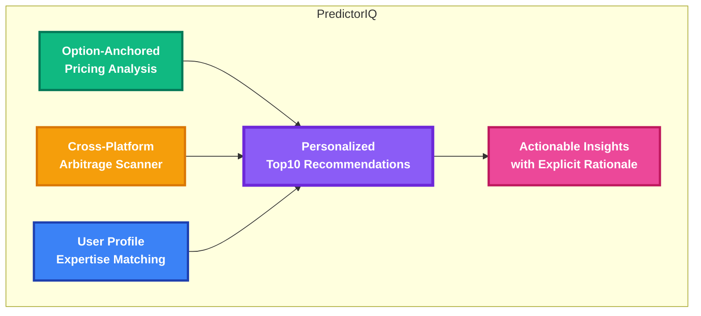
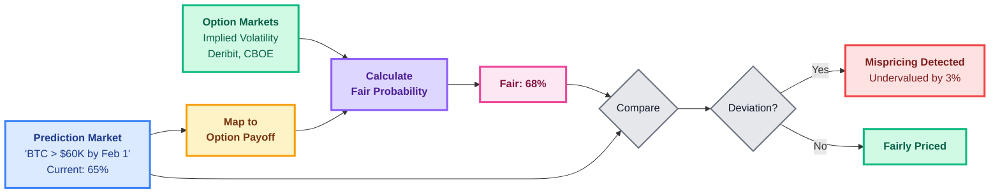
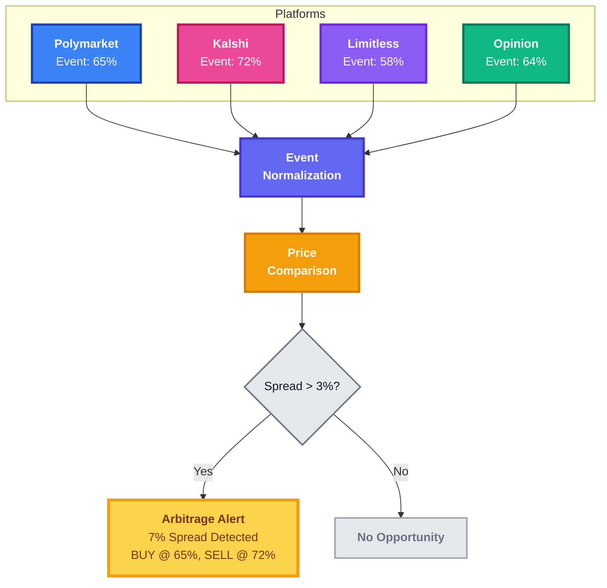
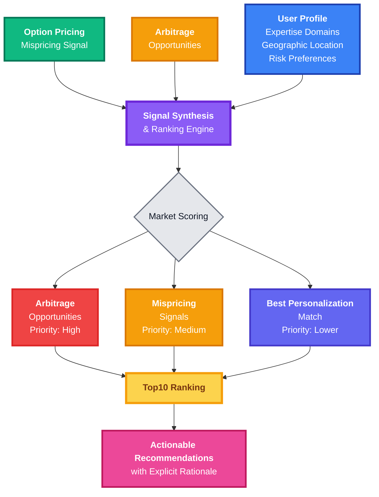

# PredictorIQ - Product Overview

> Intelligence layer for prediction markets designed for serious, long-term participants

PredictorIQ is an intelligent intelligence layer for prediction markets, designed to help traders find asymmetric opportunities where they possess a unique informational edge.

---

## The Problem

Most prediction market platforms emphasize high-volume, "trending" markets. However, the highest returns for individual traders often come from niche markets where they have specific domain expertise that the general public lacks. Additionally, market prices often reflect narrative momentum or thin liquidity rather than defensible probabilistic benchmarks.

---

## The Solution

PredictorIQ provides objective pricing anchors from professional financial markets and synthesizes multiple signals to identify markets with clear trading opportunities or optimal personalization fit.

---

## Core Product Capabilities

---

## Key Features

### 📊 Option-Anchored Pricing Analysis

Maps prediction markets to equivalent option payoffs and uses implied volatility from real option markets (Deribit, CBOE, etc.) to compute fair probabilities, identifying mispriced markets relative to professional financial benchmarks.

**Output**: Clear assessment of whether markets are **cheap**, **fair**, or **expensive** relative to option markets.

---

### ⚖️ Cross-Platform Arbitrage Scanner

Real-time identification of price discrepancies for the same event across different platforms (Polymarket, Kalshi, Opinion, Limitless).

**Output**: Actionable arbitrage opportunities with spread calculations and execution instructions across platforms.

---

### 🎯 Personalized Top10 Recommendations

Synthesizes signals from option pricing analysis, arbitrage opportunities, and user expertise matching to recommend markets with clear trading opportunities or optimal personalization fit.

**How Top10 Works**:
1. **Primary Signal Detection**: Identifies markets with arbitrage opportunities OR pricing deviations from option markets
2. **Personalization Matching**: Matches user expertise and preferences (similar to Match Score from v0.1)
3. **Liquidity Check**: Ensures sufficient liquidity and volume for execution
4. **Ranking Algorithm**: Combines opportunity score + personalization fit to produce Top10

**Each Top10 Recommendation Includes**:
- **Rank**: Overall opportunity score (0-10)
- **Primary Signal**: Arbitrage opportunity OR pricing deviation OR best personalization fit
- **Rationale**: Explicit explanation of why this market is recommended
- **Actionability**: Specific recommendation (e.g., "BUY YES - 3% undervalued vs option markets" or "Arbitrage opportunity: 7% spread detected")
- **Market Data**: Price, 24h volume, and liquidity across platforms

---

## Target Audience

- **Individual Traders**: Seeking an edge through domain-specific knowledge and objective pricing anchors
- **Institutional Firms**: Looking for systematic discovery of prediction market opportunities with professional-grade analytics
- **Arbitrageurs**: Cross-platform opportunity identification and execution
- **Market Operators**: Interested in an intelligence layer to improve user engagement and retention

---

## Demo Version Capabilities

This public repository contains the **Frontend Dashboard** and **TypeScript SDK**. To provide a complete experience without a backend, it includes a robust **Demo Mode** with:
- **Realistic Mock Data**: Samples for Top10, Arbitrage, and Option Pricing analysis
- **Interactive UI**: All navigation, filtering, and components are fully functional
- **SDK Documentation**: Clear examples of how to integrate with the PredictorIQ API

---

**Last Updated**: January 2026  
**Contact**: nelson.jingusc@gmail.com
