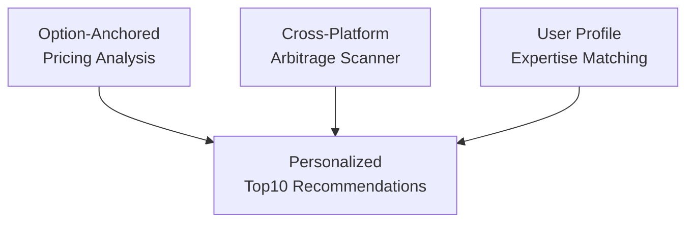

# PredictorIQ Documentation

This directory contains the product documentation for PredictorIQ.

## 📚 Documentation Files

- **[Product Overview](PRODUCT_OVERVIEW.md)**: Product vision, features, and capabilities
- **[Architecture Overview](ARCHITECTURE_OVERVIEW.md)**: Technical architecture and system design
- **[ChainGPT Integration Overview](CHAINGPT_INTEGRATION_OVERVIEW.md)**: One-page technical integration overview (architecture + functionality)
- **[Demo Guide](DEMO_GUIDE.md)**: Step-by-step walkthrough of the demo
- **[Quick Start](QUICK_START.md)**: 5-minute guide to get started
- **[Demo Mode](DEMO_MODE.md)**: Demo mode configuration guide

## 🔍 Viewing Mermaid Diagrams

The documentation includes Mermaid diagrams for visual representation of system architecture and workflows. Here are several ways to preview them:

### Method 1: VS Code Plugin (Recommended)

1. Install the **Markdown Preview Mermaid Support** extension:
   - Open VS Code Extensions (`Cmd+Shift+X` or `Ctrl+Shift+X`)
   - Search for "Markdown Preview Mermaid Support"
   - Install by **Matt Bierner**

2. Open any `.md` file in VS Code
3. Press `Cmd+Shift+V` (Mac) or `Ctrl+Shift+V` (Windows/Linux) to open preview
4. Mermaid diagrams will render automatically

### Method 2: Online Mermaid Editor

1. Go to [Mermaid Live Editor](https://mermaid.live/)
2. Copy the mermaid code block (the part between ```mermaid and ```)
3. Paste into the editor
4. View the rendered diagram

**Example**: Copy this from `PRODUCT_OVERVIEW.md`:


### Method 3: GitHub/GitLab Preview

1. Push changes to GitHub/GitLab
2. View the `.md` files directly on the platform
3. Mermaid diagrams will render automatically in GitHub/GitLab markdown viewers

### Method 4: Mermaid CLI (Advanced)

```bash
# Install Mermaid CLI
npm install -g @mermaid-js/mermaid-cli

# Generate PNG from a markdown file
mmdc -i PRODUCT_OVERVIEW.md -o output.png
```

## 📖 Quick Links

- [Product Overview with Diagrams](PRODUCT_OVERVIEW.md)
- [Architecture Overview with Diagrams](ARCHITECTURE_OVERVIEW.md)
