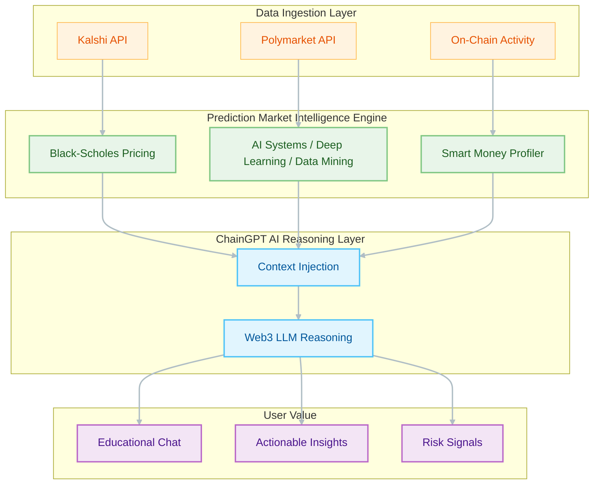

# ChainGPT POC Overview: PredictorIQ 🦉

PredictorIQ is the **"Morningstar" for the Prediction Market Economy**.

This document is the **definitive guide** for the ChainGPT integration proof-of-concept. It covers everything from technical architecture to a step-by-step walkthrough.

---

## ⚡ Quick Start: Run the Demo Now

If you are a reviewer and want to see the product in action immediately, follow these steps:

```bash
# RECOMMENDED: One-click setup and start
./start-demo.sh
```

**What this script does:**
1.  **Environment**: Creates `.env.local` with "Demo Mode" enabled.
2.  **Dependencies**: Installs all required packages.
3.  **Launch**: Starts the local server at [http://localhost:3000](http://localhost:3000).

---

## 🎬 Demo Walkthrough

Once the server is running, explore these core modules to see how ChainGPT enhances the experience:

### 1. Daily Top 10 (`/top10`)
*   **The AI Rationale**: Click "Explain" on any market card. Observation: Sage AI analyzes the spread between market price and Black-Scholes fair value to provide a plain-English "Match Score" and edge rationale.
*   **Research Copilot**: Click "Ask AI Agent" to ask follow-up questions. Observation: The agent maintains context about the specific market dynamics.

### 2. Wallet Analysis (`/wallet-tracker`)
*   **Deep profiling**: Search for a wallet like `@YetSun`. Observation: PredictorIQ audits 5,000+ trades to derive deterministic win rates, which ChainGPT then synthesizes into a readable trader profile.

### 3. Beginner's Guide (`/guide`)
*   **Interactive Learning**: Sage, the AI assistant, guides newcomers through the fundamentals of prediction markets. Observation: Users can choose from curated learning topics or ask free-form questions to receive Web3-aware educational support powered by ChainGPT.

---

## 🏗️ Technical Architecture

PredictorIQ uses a **Dual-Layer Architecture** to separate quantitative execution from AI reasoning.

### System Flow


### Integration Details
*   **Server-Side Security**: All ChainGPT calls happen via Next.js API routes (`/api/chaingpt/*`). API keys are never exposed to the browser.
*   **Demo Mode Engine**: If no key is present, the server uses `demoFallback.ts` to return realistic, high-fidelity mock data. This allows for full UX testing without API overhead.

---

## 🛠️ Feature Matrix (UC1 - UC6)

| Feature | Endpoint | Description |
| :--- | :--- | :--- |
| **Market Explanation** | `explain-market` | Short summary of why a market looks cheap or expensive |
| **Research Q&A** | `research-copilot` | User asks follow-up questions about a market |
| **Daily Digest** | `generate-digest` | Generates tweet text for daily market highlights |
| **Anomaly Alert** | `generate-anomaly-tweet` | Generates alert tweet when unusual activity is detected |
| **Product Help** | `help` | Explains PredictorIQ metrics and concepts |
| **Research Note** | `generate-daily-note` | Generates Markdown summary of top markets |

---

## 🔦 Troubleshooting & FAQ

**Q: Page shows "Connection Error" or No Data?**
*   Ensure `NEXT_PUBLIC_DEMO_MODE=true` is in your `client/.env.local`. The `./start-demo.sh` script does this automatically.

**Q: The AI response is slow?**
*   In Demo Mode, we simulate a 1-2 second "Thinking..." delay to match the live product experience.

**Q: How do I enable LIVE ChainGPT responses?**
*   Add your `CHAINGPT_API_KEY` to `client/.env.local` and restart the server.

---

**Contact**: [nelson.jingusc@gmail.com](mailto:nelson.jingusc@gmail.com)

