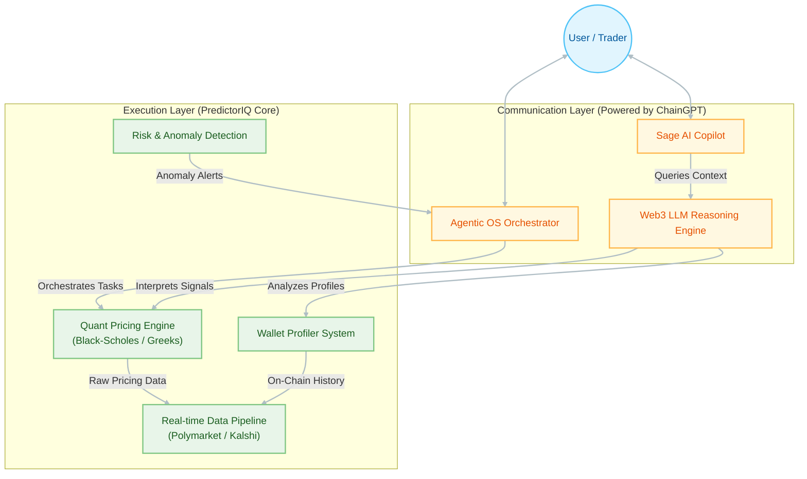

# Architecture Overview 🏛️

PredictorIQ is built on a **Dual-Layer Architecture** that separates high-frequency quantitative execution from high-level reasoning and communication.

This separation ensures that while our core engine handles complex mathematics (Black-Scholes, Greeks, probabilities) deterministically, the **ChainGPT AI Layer** provides the intelligent interface that makes these insights accessible and actionable for users.

---

## High-Level System Design

The system is composed of two primary layers:

1.  **Communication & Reasoning Layer (The Brain)**: Powered by **ChainGPT Web3 LLM** and **Agentic OS**. This layer handles user intent, explains complex data, and orchestrates workflows.
2.  **Execution & Intelligence Layer (The Engine)**: Powered by **PredictorIQ Proprietary Models**. This layer handles data ingestion, quantitative pricing, risk analysis, and on-chain execution.



---

## 1. Communication Layer (ChainGPT Integration) 🧠

This layer acts as the **Universal Interface** for the platform. It translates raw mathematical data into human-readable insights and translates user intent into machine-executable actions.

*   **Sage AI Copilot**: The primary user interface for guidance and education. It uses the **Web3 LLM** to answer questions, explain strategies, and guide users through the platform.
*   **Deep Dive Agent**: Generates comprehensive research notes. It takes structured signals (IV, Delta, Volume) from the Execution Layer and synthesizes them into investment narratives.
*   **Agentic OS**: The future backbone for autonomous workflows. It will allow users to deploy "Sniper Bots" or "Arbitrage Agents" that operate based on natural language instructions (e.g., *"Alert me if Trump's odds drop below 45% on high volume"*).

## 2. Execution Layer (PredictorIQ Core) ⚙️

This is the proprietary "black box" where the heavy lifting happens. It is deterministic, fast, and mathematically rigorous.

*   **Quantitative Engine**:
    *   **Black-Scholes Model**: Calculates implied volatility (IV) and Greeks (Delta, Gamma, Vega) for binary options.
    *   **Probability Anchoring**: Normalizes odds across different order book structures (CLOB vs. AMM).
*   **Data Pipeline**:
    *   Aggregates real-time feeds from **Polymarket** (Polygon), **Kalshi**, and **Limitless**.
    *   Normalizes disparate API formats into a unified `MarketSignal` schema.
*   **Wallet Profiler**:
    *   Scans thousands of addresses to identify "Smart Money".
    *   Computes PnL, Win Rate, and ROI based on on-chain transaction history.
*   **Risk & Anomaly Model**:
    *   Detects wash trading, manipulation attempts, and liquidity crunches.

---

## Integration Flow: The "Thinking" Process

When a user asks, *"Is this market overpriced?"*, the following flow occurs:

1.  **Ingest**: The **Execution Layer** pulls the latest order book and trade history.
2.  **Calculate**: The **Quant Engine** computes the Fair Value (Theoretical Price) based on historical volatility and time decay.
3.  **Compare**: The system identifies the divergence (Edge) between the Market Price and Fair Value.
4.  **Synthesize**: The **ChainGPT Communication Layer** receives this structured package:
    ```json
    { "market_price": 0.65, "fair_value": 0.55, "edge": 0.10, "volatility": "high" }
    ```
5.  **Explain**: Sage returns: *"This market appears overpriced by ~10 cents compared to theoretical fair value, likely due to recent hype. Volatility is high, suggesting a potential reversion."*

---

## Technology Stack

*   **Frontend**: Next.js 14, TypeScript, Tailwind CSS
*   **AI/LLM**: ChainGPT SDK, Web3 LLM API
*   **Data**: GraphQL (Polymarket), REST (Kalshi)
*   **Compute**: Serverless API Routes (Vercel)
